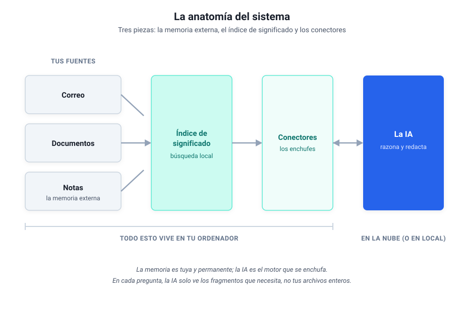
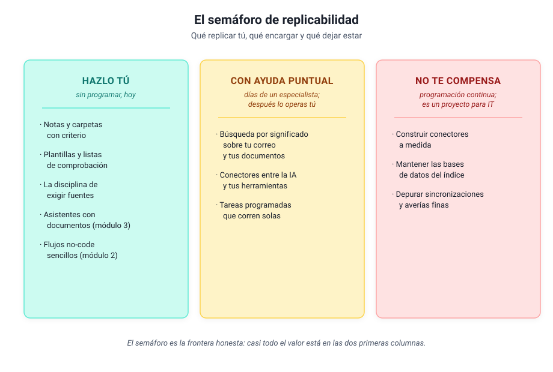

# Módulo 5 - Mirar dentro de un sistema real

## La disección guiada de mi sistema, para construir o para encargar

> [!note] Este módulo es una profundización opcional
> Todo lo que necesitas para trabajar con IA ya lo cubrieron los módulos anteriores. Este es distinto: en el [módulo 4](modulo-4-ia-que-programa.md) viste desde fuera el sistema que uso a diario; aquí le abrimos el capó. Nadie construye nada en estas páginas. El que quiera construir encontrará el mapa y sabrá por dónde empezar; el que no, saldrá sabiendo qué pedir, a quién y con qué palabras, que es exactamente lo que necesita un directivo.

---

## 1. El plano general

Ya ha asomado su nombre en los módulos anteriores: a mi sistema lo llamo Paco. Reducido a su esqueleto, Paco tiene tres piezas: una **memoria externa** (mis notas y documentos, que viven en archivos normales en mi ordenador), un **índice de significado** (lo que me permite buscar en todo eso por lo que quiero decir, y no por la palabra exacta) y unos **conectores** (los enchufes que dejan que la IA lea mi correo, mis documentos y mis notas cuando se lo pido). La IA es el motor que razona y redacta; todo lo demás es mío y se queda en mi máquina.

Hay una idea de fondo que explica por qué el sistema tiene esta forma. La IA trae de fábrica una memoria enorme y comprimida: lo que aprendió al entrenarse, que es mucho sobre el mundo y nada sobre tu negocio. Tu conocimiento (tus proyectos, tus clientes, tus actas, tu correo) no está ahí dentro, y meterlo a base de reentrenarla es carísimo y lento. La alternativa práctica es dárselo desde fuera, en el momento en que lo necesita: eso hacen las tres piezas del dibujo. **El sistema entero existe para que la IA sepa de lo tuyo sin dejar de saber del mundo.**

---

## 2. La memoria externa: notas que sobreviven a las herramientas

La base de todo son mis notas: miles de archivos de texto plano, organizados en carpetas con un criterio estable (proyectos activos, áreas permanentes, material de referencia, archivo). Nada exótico. La decisión importante no fue tecnológica sino de formato: **archivos de texto normales, legibles por cualquier programa, hoy y dentro de veinte años**. Si mañana desaparece la herramienta con la que los edito, las notas siguen ahí. Compáralo con guardar tu conocimiento dentro de una aplicación en la nube: cómodo hasta el día en que quieres salir, y ese día descubres lo que cuesta.

¿Y cómo usa la IA esa memoria? Aquí ayuda una analogía que aprendí estudiando cómo se diseñan estos sistemas: la IA tiene una memoria de trabajo pequeña (la conversación en curso, que se llena enseguida) y trabaja como trabajamos nosotros con un **cuaderno externo**: apunta lo que conviene recordar y relee lo apuntado cuando lo necesita. Mis notas son ese cuaderno. La IA no las "sabe": las consulta, igual que tú consultas tu archivador, y por eso la memoria puede crecer sin límite mientras la conversación sigue siendo ligera.

De las tres piezas, esta es la más replicable: no requiere programar nada, solo criterio y constancia. Una estructura de carpetas coherente y notas con un formato repetido ya son una memoria externa, aunque nunca conectes una IA. El día que la conectes, el trabajo estará hecho.

---

## 3. La búsqueda por significado

El problema que resuelve esta pieza lo has vivido: buscas "vacaciones" y el documento decía "días libres", y la búsqueda clásica no lo encuentra porque busca letras, no ideas. A escala de una carpeta es una molestia; a escala de años de correo y documentos es conocimiento perdido. Yo me hacía preguntas cuya respuesta estaba en mi propio archivo y no aparecía, porque yo no recordaba las palabras exactas con que la había escrito.

La solución se entiende sin matemáticas. Cada fragmento de texto se convierte en una **huella de significado**: una lista larga de números que resume de qué habla, calculada por un modelo de IA. Dos textos que hablan de lo mismo con palabras distintas producen huellas parecidas. Buscar deja de ser "encuentra esta palabra" y pasa a ser "encuentra las huellas que se parecen a la de mi pregunta". Esa huella tiene nombre técnico, *embedding*, y el almacén donde se guardan también, *base vectorial*; los dos están en el [glosario](glosario.md) y con saber que existen basta.

Sobre esa búsqueda se monta el patrón que ya conoces del módulo 3 con otro nombre: la IA **primero busca en tu material y después redacta con lo encontrado delante**, citando de dónde lo sacó. Es el asistente que consulta el archivador antes de contestar, y la razón de que responda sobre lo tuyo sin inventar tanto. En mi sistema, ese archivador indexa el correo, los documentos y las notas juntos, cientos de miles de fragmentos, todo en local: la pregunta "¿qué sé yo de este tema?" se responde en segundos contra años de material propio.

> [!note]- Profundiza: en qué se diferencia esto del módulo 3
> Los asistentes con documentos del módulo 3 hacen exactamente esto por dentro, a pequeña escala y gestionado por el proveedor: subes veinte documentos y la plataforma los trocea, calcula las huellas y busca por ti. Construir la búsqueda propia tiene sentido cuando el volumen es grande (años de correo, miles de documentos), cuando el material no puede salir de tu máquina, o cuando quieres conectarla con tus propias herramientas. Es la misma idea con la propiedad y el control cambiados de sitio.

---

## 4. Los conectores: los enchufes

La tercera pieza responde a la pregunta más práctica: ¿cómo lee la IA mi correo, si el correo está en mi ordenador y la IA no? La respuesta son los conectores del módulo 4, el estándar MCP: pequeños programas que corren en mi máquina y exponen herramientas concretas ("busca correos de este remitente", "lee esta nota", "busca por significado"). La IA pide; el conector ejecuta aquí y devuelve solo el resultado.

En mi sistema hay tres, uno por fuente: correo, documentos y notas. La consecuencia de esta arquitectura es la que más tranquiliza a un responsable de informática: **los datos no se mudan a ninguna parte**. No hay una copia de mi archivo en la nube del proveedor; hay una IA que, pregunta a pregunta, recibe los fragmentos justos que el conector le sirve. La conversación viaja; el archivo se queda.

A lo que viaja se le aplican las mismas tres preguntas del [módulo 1](modulo-1-entender-ia-generativa.md), que rigen aquí igual que en un chat. Y si parte de tu material no puede salir ni en fragmentos, la arquitectura tiene la respuesta sin cambiar el dibujo: el motor también puede ser local, con las herramientas del [módulo 4](modulo-4-ia-que-programa.md), y entonces nada abandona tu máquina.

---

## 5. Cómo se ve desde fuera: un día cualquiera

Por dentro son tres piezas; por fuera, lo que se ve es una jornada de trabajo con menos fricción. Estos son flujos reales de mi semana, con la frontera que importa: qué hace la IA y qué sigo decidiendo yo.

| Flujo | La IA hace | Yo decido |
|-------|-----------|-----------|
| Triaje del correo | Busca, extrae, sintetiza hilos, prepara borradores | Qué priorizar y qué se envía (el envío nunca es automático) |
| Preparar una reunión | Reúne en minutos lo relevante de notas y correo | El tema, si el resumen basta, qué falta |
| Leer documentos largos | Convierte, trocea, resume y enlaza a mis notas | Qué merece lectura completa y qué destino tiene |
| Redactar entregables | Estructura, contexto, verificación de datos | Los párrafos de fondo, los números, la aprobación |
| Mantener el archivo | Clasifica, etiqueta, conecta notas relacionadas | Los casos dudosos |

La fila que más cuesta interiorizar es la primera: por mucha automatización que haya debajo, **nada sale de mi nombre sin pasar por mí**. Esa regla es una decisión de diseño deliberada, y es la que recomiendo copiar antes que ninguna otra.

---

## 6. El semáforo de replicabilidad

La pregunta que ningún curso responde: ¿cuánto de esto puedes montar tú? Depende de la pieza, y la respuesta cabe en un semáforo.

**Verde: hazlo tú, sin programar, hoy.** La estructura de notas y carpetas, las plantillas y listas de comprobación, la disciplina de exigir fuentes a la IA, los asistentes con documentos del módulo 3 y los flujos no-code sencillos del módulo 2. Es la capa que más valor da por hora invertida, y este curso la ha enseñado entera.

**Ámbar: con ayuda puntual de un especialista.** La búsqueda por significado sobre tu correo y tus documentos, los conectores y las tareas programadas que corren solas. En mi experiencia, cada pieza de estas es un encargo de días de trabajo de alguien que sabe, no de meses; montada una vez, la operas tú a diario sin tocar la tripa, con el mantenimiento del que habla el [módulo 6](modulo-6-evaluar-y-escalar.md).

**Rojo: no te compensa como no programador.** Construir los conectores a medida, mantener las bases de datos del índice, depurar las sincronizaciones cuando fallan de formas raras. Yo he pasado por ahí con un asistente de código y mucha paciencia, y aun así es la parte que más horas se ha llevado. Si tu caso lo exige de verdad, es un proyecto para el equipo técnico, con presupuesto y responsable, y ninguna vergüenza hay en ello.

> [!tip] Observación práctica
> La trampa habitual es empezar por el ámbar o el rojo porque es lo que sale en los vídeos. El orden rentable es el contrario: agota el verde primero. Si después la búsqueda sobre tu propio archivo sigue doliendo, ese dolor concreto es justo lo que justifica el encargo de la capa ámbar, y ya sabrás describirlo.

---

## 7. Qué pedir y a quién

Si decides encargar la capa ámbar, la diferencia entre un buen encargo y un pozo sin fondo está en cómo lo pides. Tres reglas de mi propia experiencia:

1. **Pide una pieza, no un sistema.** "Quiero buscar por significado en mis documentos de proyecto" es un encargo; "quiero un sistema de IA" es un presupuesto abierto.
2. **Exige que quede en local y documentado.** Que los datos no salgan de tu máquina u organización, y que quede escrito qué hace, cómo se arranca y a quién llamar si falla. Lo aprendiste en el módulo 6 para tus flujos; aplica igual a lo que encargues.
3. **Busca un especialista puntual, no un departamento.** Son encargos de días. Un perfil técnico de confianza (interno o externo) que te entregue la pieza funcionando y te enseñe a operarla.

La frase que resume el encargo tipo:

> "Quiero poder buscar por significado en [esta fuente concreta], en local, sin que los datos salgan de la organización. Necesito que quede documentado y que yo pueda usarlo a diario sin tocar la configuración. ¿Cuántos días de trabajo es?"

Con el vocabulario de este módulo (memoria externa, índice de significado, conectores) entenderás la respuesta que te den, y sobre todo detectarás cuándo te están vendiendo un sistema entero para un problema de una pieza.

---

## 8. Aplícalo

> [!example] Aplícalo
> Dos caminos, según lo que te haya picado. **Si quieres hacer:** elige una pieza de la columna verde del semáforo que aún no tengas (la estructura de carpetas y notas es la mejor primera) y móntala esta semana; todo lo necesario está en los módulos anteriores. **Si quieres encargar:** escribe el encargo de una pieza ámbar en cinco líneas (qué fuente, qué preguntas quieres hacerle, dónde debe vivir, qué documentación exiges) y guárdalo; el día que tengas al especialista delante, esa media página te ahorrará la mitad del presupuesto.

---

## Autoevaluación

> [!question] Comprueba lo que te llevas
> Respóndete a estas tres y despliega para comprobar.
>
> 1. ¿Cuáles son las tres piezas del sistema?
> 2. Quieres buscar por significado en años de tu correo. ¿En qué color del semáforo cae, y qué implica?
> 3. Si solo copiaras una regla de mi sistema, ¿cuál recomiendo?

> [!note]- Soluciones
> 1. **Memoria externa** (tus notas y documentos), **índice de significado** (la búsqueda) y **conectores** (los enchufes a la IA).
> 2. En **ámbar**: es un encargo de días a un especialista; una vez montado, lo operas tú sin tocar la tripa.
> 3. La regla de diseño: **la IA ejecuta, tú decides, y nada sale con tu nombre sin pasar por ti**.

---

## 9. Cierre y aprendizajes clave

- **El sistema tiene tres piezas**: memoria externa, índice de significado y conectores. La IA es el motor; el conocimiento es tuyo y se queda contigo.
- **La memoria externa es la pieza más replicable** y no exige programar: archivos de texto, carpetas con criterio y constancia.
- **La búsqueda por significado** encuentra ideas y no palabras, y es lo que convierte años de material propio en algo consultable.
- **El semáforo marca la frontera real**: verde para hacer, ámbar para encargar con criterio, rojo para dejar al equipo técnico.
- **La regla que más vale copiar es de diseño**: la IA ejecuta, tú decides, y nada sale con tu nombre sin pasar por ti.

> [!abstract] Resumen del módulo
> Has visto por dentro un sistema real: qué piezas tiene, por qué tiene esa forma y cuánto cuesta cada una de verdad. Sabes qué parte puedes replicar tú con lo aprendido en el curso, qué parte se encarga en días a un especialista y cómo redactar ese encargo, y qué parte conviene dejar a IT.

---

> [!info] Para profundizar
> - [Model Context Protocol](https://modelcontextprotocol.io/introduction): el estándar de los conectores, explicado por sus autores.
> - [Building Effective AI Agents: Anthropic](https://www.anthropic.com/engineering/building-effective-agents): para el que quiera construir, los patrones de diseño que funcionan.
> - [Ollama](https://ollama.com/): la vía para que el motor también corra en tu ordenador, si el material lo exige.

---

En el [Módulo 6](modulo-6-evaluar-y-escalar.md) volvemos al terreno de todos: cómo probar, medir y mantener lo que construyas (o encargues) para que funcione más allá de tu portátil.
